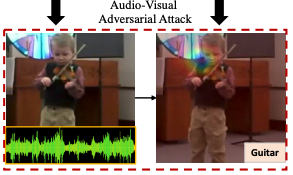

Can audio-visual integration strengthen robustness under multimodal attacks? (To appear in CVPR 2021) [[Paper]](https://arxiv.org/pdf/2104.02000.pdf)

[Yapeng Tian](http://yapengtian.org/) and [Chenliang Xu](https://www.cs.rochester.edu/~cxu22/) 


### Robustness of audio-visual learning under multimodal attacks

we propose to make a systematic study on machines’ multisensory perception under attacks. We
use the audio-visual event recognition task against multimodal adversarial attacks as a proxy to investigate the robustness of audio-visual learning. We attack audio, visual,
and both modalities to explore whether audio-visual integration still strengthens perception and how different fusion
mechanisms affect the robustness of audio-visual models.



### Requirements

```bash
pip install -r requirements
```
### Audio-Visual Attack
There are typos in the captions of Tab. 1 and Tab. 3. The perturbation strengthens are 0.006 and 0.012 as in Fig. 3 (10^-3) rather than 0.06 and 0.12.

Training:


```bash
./scripts/train_attack_MUSIC.sh
```

```bash
./scripts/train_attack_AVE.sh
```

```bash
./scripts/train_attack_Kinetics.sh
```

Testing: 

```bash
./scripts/eval_attack_MUSIC.sh
```

```bash
./scripts/eval_attack_AVE.sh
```


```bash
./scripts/eval_attack_Kinetics.sh
```


### Audio-Visual Defense against Multimodal Attacks 

Training:

```bash
./scripts/train_defense_MUSIC.sh
```

```bash
./scripts/train_defense_AVE.sh
```

```bash
./scripts/train_defense_Kinetics.sh
```

Testing: 

```bash
./scripts/eval_defense_MUSIC.sh
```

```bash
./scripts/eval_defense_AVE.sh
```


```bash
./scripts/eval_defense_Kinetics.sh
```


### Citation

If you find this work useful, please consider citing it.

<pre><code>@InProceedings{tian2020avrobustness,
  author={Tian, Yapeng and Xu, Chenliang},
  title={Can audio-visual integration strengthen robustness under multimodal attacks?},
  booktitle = {CVPR},
  year = {2021}
}
</code></pre>


 
 ### Acknowledgements
 
We borrowed a lot of code from [SoP](https://github.com/hangzhaomit/Sound-of-Pixels). We thank the authors for sharing their codes. If you use our codes, please also cite their nice work.
